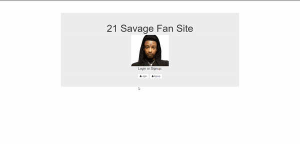

# 21 Savage Fan Site With User Authentication

Welcome to the updated version of the Savage Demo application – a 21 Savage message board site for fans! This iteration introduces user authentication, allowing users to log in and sign up for the site. Users are identified in the message board through their account email, and they have the ability to delete their account using the unlink button and log out as well.

## How It's Made

**Tech used:** HTML, CSS, JavaScript, Bootstrap, Node.js

In building this project, I leveraged HTML, CSS, and JavaScript to create an engaging and interactive user interface. Bootstrap was employed to enhance the design and ensure responsiveness. Node.js was used on the server side to handle user authentication, allowing for a secure and personalized experience on the message board.

## Lessons Learned

The journey of creating this updated version of the Savage Demo application brought about various learning moments. The introduction of user authentication highlighted the importance of secure and seamless user experiences. Overcoming challenges related to account deletion and logout functionality underscored the significance of robust user management features.

## Installation

1. Clone repo
2. run `npm install`

## Usage

1. run `node server.js`
2. Navigate to `localhost:8000`
